# Chat - LLM 角色扮演聊天模拟器

> 最后更新：2026-04-18

---

## 变更记录 (Changelog)

### 2026-04-18
- **重构**：叙事引擎提取共享常量到 `constants.js`（统一情绪词典、关系类型、好感度等级、互动模式、事件映射、语气提示）
- **修复**：情绪衰减改为每次调用时执行；事件 impact 通过 `EVENT_EMOTION_MAP` 映射到标准情绪词；情绪查询限定群组角色范围
- **修复**：好感度双向更新（A→B 更新时 B→A 同步变化，幅度减半）；`@角色名` 精确解析具体角色名；互动模式支持多模式匹配
- **修复**：余波字符上限统一 50 字；触发者改为情绪强度加权选择；`_shouldTriggerAftermath` 空数组保护
- **修复**：手动触发事件 key 追加时间戳后缀避免去重误判；推荐去重使用基础 key 匹配
- **修复**：角色删除时自动清理叙事数据（`removeCharacter` 方法，清理情绪+双向关系）；`setupCharacterHandlers` 新增 `narrativeEngine` 参数
- **新增**：`narrative/constants.js` 共享常量文件
- **删除**：`engine.js` 中 `_parseAftermath` 死代码；`prompt-builder.js` 中重复的内联实现
- **补充**：7 种情绪新增关键词（紧张、惊慌、好奇、无奈、沮丧、焦虑、恐慌）
- **优化**：情绪更新先执行内存匹配，无匹配且无活跃情绪时跳过数据库操作
- **优化**：余波 Prompt 只注入触发者自身情绪，减少 token 消耗
- **更新**：全面架构扫描，校准叙事引擎模块文档
- **更新**：数据模型新增叙事引擎相关字段和表（`narrative_enabled`、`aftermath_enabled`、`event_scene_type`、`is_aftermath`、`message_type`）
- **更新**：叙事系统 IPC 接口从 13 个扩充为 14 个（新增 `narrative:deleteEvent`、`narrative:setEmotion`、`narrative:getEmotion`、`narrative:removeRelationship`、`narrative:getRelationshipTypes`、`narrative:getEventPool`）
- **更新**：情绪词典扩展至 15 种情绪关键词（新增紧张、惊慌、好奇、无奈、沮丧、焦虑、恐慌，每种均有基础关键词）
- **更新**：事件场景从 4 场景 16 事件扩展为 7 场景约 85 事件（新增 home、school、restaurant、travel、party）
- **更新**：余波编排从多人模式改为单角色模式（`_parseSingleAftermath`），余波消息携带 `message_type`、`is_aftermath`、`model`、`prompt_tokens`、`completion_tokens`
- **更新**：好感度系统支持 6 级等级（深厚/亲密/友好/中立/不满/敌对）和 4 类互动模式（praise/criticize/share/empathy），双向更新，@角色名精确解析
- **更新**：数据库迁移新增叙事引擎相关字段（`narrative_enabled`、`aftermath_enabled`、`event_scene_type`、`is_aftermath`、`message_type`）
- **新增**：`narrative` 模块级 CLAUDE.md 文档
- **新增**：叙事引擎模块在模块索引中添加独立文档链接
- **更新**：Mermaid 结构图新增叙事引擎组件（EmotionTag、RelationshipPanel、EventPanel、StalenessTip）和 narrative Store
- **更新**：前端组件结构新增叙事相关组件（EmotionTag、RelationshipPanel、EventPanel、StalenessTip 位于 chat/ 目录）
- **更新**：Pinia Store 从 8 个扩展为 9 个（新增 `narrative.js`）

### 2026-04-17
- **新增**：AI 快速建群功能（`QuickGroupDialog.vue`、`llm:generateGroup` IPC 接口）
- **新增**：快速建群配置管理（`quickGroupConfig`、可配置提示词模板）
- **新增**：角色级独立 LLM 配置（`custom_llm_profile_id` 字段，每个角色可使用不同模型）
- **新增**：角色库同步功能（`syncToGroup`、`syncToAllGroups`、`existsInLibrary` 接口）
- **新增**：JSON 提取工具（`electron/utils/json-extractor.js`，支持 markdown 代码块、截断修复）
- **新增**：消息模型记录（`messages.model` 字段，记录实际使用的 LLM 模型）
- **新增**：LLM Profile 更新时自动同步关联群组配置
- **新增**：供应商：智谱AI Coding（`zhipu-coding`，专用 Coding 端点）
- **优化**：供应商模型列表更新（OpenAI gpt-5.4 系列、通义千问 qwen3/qwen3.5、智谱 glm-5/5.1、MiniMax M2.7 系列）
- **优化**：角色导入群组时使用角色库原始 ID（便于追溯和同步）
- **删除**：`docs/` 目录（设计文档已归档）
- **删除**：`electron/database/migrations/add_user_character.js`（迁移已内联到 manager.js）
- **修正**：全局角色库导入机制从"创建副本"改为"使用原始 ID"
- **新增**：叙事引擎系统（`narrative/` 模块，包含情绪状态机、角色关系图谱、事件触发系统、余波编排）
- **新增**：角色情绪系统（关键词匹配 + LLM 推断混合模式，8 种内置情绪）
- **新增**：角色关系系统（7 种预设关系类型，双向动态好感度 -100~100）
- **新增**：事件触发系统（4 场景 16 预设事件，推荐算法 + 平淡检测）
- **新增**：角色间余波编排（自动生成角色间追评互动）
- **新增**：前端叙事组件（EmotionTag、RelationshipPanel、EventPanel、StalenessTip）
- **新增**：叙事系统 IPC 接口（14 个通道 + aftermath 事件推送）
- **新增**：群设置叙事配置（叙事引擎开关、余波开关、事件场景类型）
- **优化**：LLM 对话流程集成叙事上下文注入（情绪+关系+事件）

### 2026-03-29
- **新增**：全局角色库系统（`global-character-manager.js`、`GlobalCharacterDialog.vue`、`CharacterLibrary.vue`）
- **新增**：角色标签管理（标签 CRUD、角色-标签关联、标签筛选）
- **新增**：角色记忆系统（`memory-manager.js`、`MemoryStore`、手动/自动记忆提取）
- **新增**：AI 角色抽卡功能（`CharacterGachaDialog.vue`、可配置抽卡提示词）
- **新增**：全局搜索功能（`search.js` Handler、`GroupSearch.vue`、跨群组搜索消息和角色）
- **新增**：系统提示词模板管理（`system-prompts.js`、8 个内置模板）
- **新增**：通用 UI 组件（`Toast`、`ConfirmDialog`、`TagFilter`、`TagSelector`、`useDialog` composable）
- **新增**：LLM 配置面板（`LLMConfigPanel.vue`、按供应商分组管理）
- **新增**：编辑角色对话框（`EditCharacterDialog.vue`、支持角色设定编辑）
- **新增**：左侧面板 Tab 导航（`LeftPanel.vue`、聊天群/角色库/LLM 配置三 Tab）
- **新增**：新增供应商：智谱AI（GLM 系列）、ModelScope 魔塔、MiniMax
- **优化**：布局改为四栏 grid（含可隐藏分割线），右侧面板支持双击隐藏
- **优化**：流式输出（Stream）支持，含推理过程展示（reasoning_content）
- **优化**：角色排序支持（position 字段）、随机发言顺序（random_order）
- **优化**：消息支持 token 用量统计（prompt_tokens / completion_tokens）
- **优化**：上下文构建增强：群成员介绍、角色全局记忆注入、定向指令过滤
- **优化**：数据库 Schema 新增字段：`random_order`、`system_prompt`、`position`、`thinking_enabled`（角色级）、`reasoning_content`、`prompt_tokens`、`completion_tokens`、`auto_memory_extract`
- **优化**：Preload API 大幅扩展（消息 CRUD、流式事件、角色抽卡、全局角色库、记忆管理、全局搜索、系统提示词模板、抽卡配置等）
- **优化**：`App.vue` 添加全局 Toast 组件

### 2026-03-27
- **新增**：Ollama 原生 API 支持（双模式：OpenAI 兼容 / 原生 API）
- **新增**：`electron/llm/ollama-client.js` - 原生 Ollama 客户端
- **优化**：Ollama 供应商支持原生 `think` 参数
- **优化**：前端 LLM 配置表单支持 API 模式选择

### 2026-03-20
- **更新**：添加群背景设定功能（`background` 字段）
- **更新**：添加思考模式支持（`thinking_enabled` 字段）
- **更新**：添加用户角色支持（`is_user` 字段）
- **新增**：LLM 配置管理系统（Profile 管理）
- **新增**：群设置对话框（`GroupSettingsDialog.vue`）
- **优化**：改进角色面板 UI，用户角色显示特殊样式

### 2026-03-20
- 初始化项目 AI 上下文文档
- 完成架构扫描与模块分析
- 生成 Mermaid 结构图与模块索引

---

## 项目愿景

一个基于 Electron + Vue 3 的桌面聊天模拟器，支持多 AI 角色扮演对话。用户可以创建聊天群、添加多个 AI 角色（每个角色有独立的人设），并让这些角色通过 LLM 进行群聊对话。应用支持多种 LLM 供应商（OpenAI、DeepSeek、通义千问等），并提供顺序/并行两种对话模式。

### 核心特性
- **多角色对话**：一个聊天群中可添加多个 AI 角色，每个角色独立设定
- **AI 快速建群**：输入群组描述，AI 自动生成群名称、背景设定和多个角色
- **角色级 LLM 配置**：每个角色可独立配置不同的 LLM Profile 和模型
- **全局角色库**：跨群组的角色库，支持标签分类、搜索、一键导入到群组，支持同步更新
- **AI 角色抽卡**：使用 LLM 随机生成角色信息（姓名、性别、年龄、人设）
- **角色记忆系统**：为角色手动或自动添加记忆，AI 对话时参考记忆内容
- **多 LLM 支持**：支持 OpenAI、DeepSeek、通义千问、Moonshot、智谱AI、MiniMax、ModelScope、Ollama 等 12 个供应商
- **灵活配置**：支持全局和群组独立的 API Key 配置，LLM 配置 Profile 管理，Profile 更新自动同步群组
- **代理支持**：支持 HTTP/HTTPS/SOCKS5 代理，可按 Profile 独立配置
- **本地存储**：每个聊天群使用独立的 SQLite 数据库存储，全局角色库独立存储
- **微信风格 UI**：简洁优雅的微信绿色主题界面，三栏（可隐藏右侧栏）
- **两种回复模式**：顺序模式（适合剧情演绎）和并行模式（适合快速讨论）
- **流式输出**：支持 SSE 流式消息推送，实时展示 AI 回复过程
- **群背景设定**：为每个群组设置背景场景，增强对话沉浸感
- **思考模式**：支持 LLM 思考模式（如 DeepSeek Reasoner），展示推理过程
- **用户角色**：支持添加用户角色，区分用户和 AI 角色
- **全局搜索**：跨群组搜索消息内容和角色名称
- **系统提示词模板**：内置 8 个多角色对话模板，支持自定义
- **角色排序**：支持拖拽排序 AI 角色发言顺序，支持随机发言
- **消息管理**：支持消息编辑、删除、从某条开始删除、清空、导出 ZIP
- **叙事引擎**：15 种情绪状态机（关键词+LLM混合推断，每次调用衰减）、7 种预设关系类型与 6 级好感度（双向更新）、7 场景约 85 个预设事件（含事件-情绪映射）、单角色余波互动（情绪加权选择）、对话平淡检测、角色删除自动清理

---

## 架构总览

### 技术栈
- **桌面框架**：Electron 41.2.0
- **前端框架**：Vue 3.5.32 (Composition API)
- **构建工具**：electron-vite 5.0.0 + Vite 8.0.8
- **状态管理**：Pinia 3.0.4
- **数据库**：better-sqlite3 12.8.0
- **HTTP 客户端**：axios 1.15.0
- **样式**：SCSS (Sass 1.99.0)
- **语言**：JavaScript (ES Modules)

### 架构模式
- **主进程（Main Process）**：负责窗口管理、IPC 通信、数据库操作、LLM API 调用
- **渲染进程（Renderer Process）**：负责 UI 渲染、用户交互、状态管理
- **Preload 脚本**：通过 contextBridge 暴露安全的 API 给渲染进程
- **数据层**：
  - 每个聊天群使用独立的 SQLite 数据库文件（`group_{id}.sqlite`）
  - 全局角色库使用独立数据库（`character-library.sqlite`）
  - 角色记忆使用独立数据库（`character-memories.sqlite`）

### 数据流
1. 用户在 Vue 组件中操作（发送消息、创建群组等）
2. Pinia Store 调用 `window.electronAPI`（通过 Preload 暴露）
3. IPC 调用触发主进程的 Handler
4. Handler 操作数据库或调用 LLM API
5. 主进程通过流式事件（`message:stream:chunk`）或一次性返回将结果推回渲染进程
6. 渲染进程更新 Store，UI 自动响应

---

## 模块结构图

```mermaid
graph TD
    Root["(根) chat-simulator"] --> Electron["electron (主进程)"];
    Root --> Src["src (渲染进程)"];

    Electron --> DB["database (数据层)"];
    Electron --> IPC["ipc (通信层)"];
    Electron --> LLM["llm (LLM 服务)"];
    Electron --> Config["config (配置管理)"];
    Electron --> Utils["utils (工具)"];
    Electron --> Narrative["narrative (叙事引擎)"];

    DB --> DBManager["manager.js<br/>数据库管理器"];
    DB --> Schema["schema.sql<br/>数据库结构"];
    DB --> GlobalCharMgr["global-character-manager.js<br/>全局角色库管理器"];
    DB --> MemoryMgr["memory-manager.js<br/>角色记忆管理器"];

    IPC --> Channels["channels.js<br/>IPC 通道常量"];
    IPC --> Handlers["handlers (IPC 处理器)"];
    Handlers --> GroupHandler["group.js"];
    Handlers --> CharacterHandler["character.js"];
    Handlers --> MessageHandler["message.js"];
    Handlers --> LLMHandler["llm.js"];
    Handlers --> ConfigHandler["config.js"];
    Handlers --> GlobalCharHandler["global-character.js"];
    Handlers --> MemoryHandler["memory.js"];
    Handlers --> SearchHandler["search.js"];
    Handlers --> NarrativeHandler["narrative.js"];

    LLM --> Client["client.js<br/>LLM 客户端"];
    LLM --> OllamaClient["ollama-client.js<br/>Ollama 原生客户端"];
    LLM --> Providers["providers (供应商)"];
    LLM --> Proxy["proxy.js (代理)"];

    Config --> ConfigMgr["manager.js<br/>全局配置"];
    Config --> LLMProfiles["llm-profiles.js<br/>LLM 配置文件"];
    Config --> SystemPrompts["system-prompts.js<br/>提示词模板"];

    Utils --> UUID["uuid.js<br/>UUID 生成"];
    Utils --> JSONExtractor["json-extractor.js<br/>JSON 提取"];

    Narrative --> Constants["constants.js<br/>共享常量"];
    Narrative --> Engine["engine.js<br/>叙事引擎主控"];
    Narrative --> EmotionMgr["emotion-manager.js<br/>情绪状态机"];
    Narrative --> RelMgr["relationship-manager.js<br/>关系图谱管理"];
    Narrative --> EventTrig["event-trigger.js<br/>事件触发系统"];
    Narrative --> PromptBld["prompt-builder.js<br/>叙事上下文构建"];

    Src --> Components["components (组件)"];
    Src --> Stores["stores (状态管理)"];
    Src --> Styles["styles (样式)"];
    Src --> Composables["composables (组合函数)"];

    Components --> Layout["layout (布局)"];
    Components --> Chat["chat (聊天)"];
    Components --> ConfigC["config (配置)"];
    Components --> Common["common (通用)"];

    Layout --> MainLayout["MainLayout.vue"];
    Layout --> LeftPanel["LeftPanel.vue<br/>三 Tab 面板"];
    Layout --> GroupList["GroupList.vue"];
    Layout --> CharacterLibrary["CharacterLibrary.vue<br/>全局角色库"];
    Layout --> GroupSearch["GroupSearch.vue<br/>全局搜索"];

    Chat --> ChatWindow["ChatWindow.vue"];
    Chat --> MessageBubble["MessageBubble.vue"];
    Chat --> MessageInput["MessageInput.vue"];
    Chat --> CharacterPanel["CharacterPanel.vue"];
    Chat --> EmotionTag["EmotionTag.vue<br/>情绪标签"];
    Chat --> RelationshipPanel["RelationshipPanel.vue<br/>关系图谱"];
    Chat --> EventPanel["EventPanel.vue<br/>事件面板"];
    Chat --> StalenessTip["StalenessTip.vue<br/>平淡提示"];

    ConfigC --> CreateGroup["CreateGroupDialog.vue"];
    ConfigC --> QuickGroup["QuickGroupDialog.vue"];
    ConfigC --> CreateCharacter["CreateCharacterDialog.vue"];
    ConfigC --> EditCharacter["EditCharacterDialog.vue"];
    ConfigC --> GlobalCharDialog["GlobalCharacterDialog.vue"];
    ConfigC --> CharacterGacha["CharacterGachaDialog.vue"];
    ConfigC --> GroupSettings["GroupSettingsDialog.vue"];
    ConfigC --> LLMProfile["LLMProfileDialog.vue"];
    ConfigC --> LLMProfileForm["LLMProfileForm.vue"];
    ConfigC --> LLMConfigPanel["LLMConfigPanel.vue"];

    Common --> Toast["Toast.vue"];
    Common --> ConfirmDialog["ConfirmDialog.vue"];
    Common --> TagFilter["TagFilter.vue"];
    Common --> TagSelector["TagSelector.vue"];

    Stores --> GroupsStore["groups.js"];
    Stores --> CharactersStore["characters.js"];
    Stores --> MessagesStore["messages.js"];
    Stores --> ConfigStore["config.js"];
    Stores --> LLMProfilesStore["llm-profiles.js"];
    Stores --> GlobalCharsStore["global-characters.js"];
    Stores --> ToastStore["toast.js"];
    Stores --> MemoryStore["memory.js"];
    Stores --> NarrativeStore["narrative.js"];

    Composables --> UseDialog["useDialog.js"];

    Styles --> Variables["variables.scss"];
    Styles --> Global["global.scss"];

    click Electron "./electron/CLAUDE.md" "查看 electron 模块文档"
    click Src "./src/CLAUDE.md" "查看 src 模块文档"
    click Narrative "./electron/narrative/CLAUDE.md" "查看叙事引擎模块文档"
```



---

## 模块索引

| 模块名称 | 路径 | 类型 | 职责 | 文档 |
|---------|------|------|------|------|
| **electron** | `electron/` | Electron 主进程 | 窗口管理、IPC 通信、数据库、LLM 调用、快速建群、角色同步 | [CLAUDE.md](./electron/CLAUDE.md) |
| **src** | `src/` | Vue 渲染进程 | UI 组件、状态管理、样式 | [CLAUDE.md](./src/CLAUDE.md) |
| **narrative** | `electron/narrative/` | 叙事引擎 | 情绪状态机、关系图谱、事件触发、余波编排、Prompt 构建 | [CLAUDE.md](./electron/narrative/CLAUDE.md) |

---

## 运行与开发

### 前置要求
- Node.js >= 18
- npm >= 9（或 pnpm）

### 开发模式
```bash
# 安装依赖
npm install

# 启动开发模式（自动设置控制台 UTF-8 编码）
npm run dev
```

### 打包
```bash
# Windows
npm run build:win

# macOS
npm run build:mac

# Linux
npm run build:linux
```

### 环境变量
开发模式会自动加载 Vite 开发服务器（`http://localhost:5173`），生产模式加载打包后的 `index.html`。

---

## 数据模型

### 数据库结构
应用使用三类独立 SQLite 数据库：

#### 1. 群组数据库（`data/groups/group_{id}.sqlite`）

##### groups（群组表）
- `id`: 群组 ID（主键）
- `name`: 群组名称
- `llm_provider`: LLM 供应商（openai、deepseek 等）
- `llm_model`: 模型名称
- `llm_api_key`: 独立 API Key（可选）
- `llm_base_url`: 自定义 API 地址（可选）
- `max_history`: 最大历史轮数（默认 20）
- `response_mode`: 回复模式（sequential/parallel）
- `use_global_api_key`: 是否使用全局 API Key
- `thinking_enabled`: 是否启用思考模式（0/1）
- `random_order`: 是否随机发言顺序（0/1）
- `background`: 群背景设定（可选，文本）
- `system_prompt`: 群系统提示词（可选，文本）
- `auto_memory_extract`: 是否自动提取角色记忆（0/1）
- `narrative_enabled`: 是否启用叙事引擎（默认 1）
- `aftermath_enabled`: 是否启用余波编排（默认 1）
- `event_scene_type`: 事件场景类型（默认 'general'，可选 office/home/school/restaurant/travel/party/general）
- `created_at`: 创建时间
- `updated_at`: 更新时间

##### characters（角色表）
- `id`: 角色 ID（主键）
- `group_id`: 所属群组 ID（外键）
- `name`: 角色名称
- `system_prompt`: 系统提示词（人设）
- `enabled`: 是否启用（0/1）
- `is_user`: 是否为用户角色（0/1）
- `position`: 发言排序位置（整数，AI 角色排序）
- `thinking_enabled`: 角色级思考模式开关（0/1）
- `custom_llm_profile_id`: 角色独立 LLM Profile ID（可选，指向 llm-profiles 中的配置）
- `created_at`: 创建时间

##### messages（消息表）
- `id`: 消息 ID（主键）
- `group_id`: 所属群组 ID（外键）
- `character_id`: 发送角色 ID（外键，可选）
- `role`: 角色（user/assistant/system）
- `content`: 消息内容
- `reasoning_content`: 推理过程内容（思考模式）
- `prompt_tokens`: 输入 token 数
- `completion_tokens`: 输出 token 数
- `model`: 实际使用的 LLM 模型名称（可选）
- `is_aftermath`: 是否为余波消息（0/1）
- `message_type`: 消息类型（normal/event/aftermath）
- `timestamp`: 时间戳

##### character_emotions（角色情绪表）
- `character_id`: 角色 ID（主键）
- `emotion`: 当前情绪（默认 '平静'）
- `intensity`: 情绪强度（0.0~1.0）
- `decay_rate`: 衰减速率（默认 0.1）
- `source`: 来源（keyword/llm/manual/event）
- `updated_at`: 更新时间

##### character_relationships（角色关系表）
- `from_id` + `to_id`: 联合主键（双向关系）
- `type`: 关系类型（friend/lover/rival/mentor/colleague/family/stranger）
- `favorability`: 好感度（-100~100）
- `description`: 关系描述
- `updated_at`: 更新时间

##### narrative_events（叙事事件记录表）
- `id`: 事件 ID（主键）
- `group_id`: 所属群组 ID（外键）
- `event_key`: 事件标识键
- `content`: 事件内容描述
- `impact`: 事件影响（情绪类型）
- `event_type`: 事件类型（user_triggered）
- `triggered_by`: 触发来源
- `created_at`: 创建时间

#### 2. 全局角色库数据库（`data/global/character-library.sqlite`）

##### global_characters（全局角色表）
- `id`: 角色 ID（主键）
- `name`: 角色名称
- `gender`: 性别（male/female/other）
- `age`: 年龄
- `system_prompt`: 人物设定
- `created_at`/`updated_at`: 时间戳

##### tags（标签表）
- `id`: 标签 ID（主键）
- `name`: 标签名称（唯一）
- `color`: 标签颜色
- `is_default`: 是否系统默认标签（0/1）

##### character_tags（角色-标签关联表）
- `character_id` + `tag_id`: 联合主键

#### 3. 角色记忆数据库（`data/global/character-memories.sqlite`）

##### character_memories（角色记忆表）
- `id`: 记忆 ID（主键）
- `character_name`: 角色名称（按名称关联）
- `content`: 记忆内容
- `source`: 来源（manual/auto）
- `group_id`: 来源群组 ID（自动提取时记录）
- `created_at`/`updated_at`: 时间戳

完整 SQL 结构见 [`electron/database/schema.sql`](./electron/database/schema.sql)。内联 Schema（含叙事引擎表）定义在 [`electron/database/manager.js`](./electron/database/manager.js) 的 `SCHEMA_SQL` 常量中。

### 数据库迁移
项目使用内联迁移机制，在 `DatabaseManager.runMigrations()` 中自动执行：

1. **添加 reasoning_content 字段**：消息表添加推理过程内容
2. **添加 position 字段**：角色表添加排序位置（含规范化已有数据）
3. **添加 thinking_enabled 字段（角色级）**：角色级思考模式开关
4. **添加 random_order 字段**：群组随机发言顺序
5. **添加 prompt_tokens/completion_tokens 字段**：消息 token 统计
6. **添加 custom_llm_profile_id 字段**：角色独立 LLM Profile
7. **添加 model 字段**：消息实际使用的模型
8. **添加 auto_memory_extract 字段**：自动记忆提取开关
9. **添加 narrative_enabled 字段**：群组叙事引擎开关（默认开启）
10. **添加 aftermath_enabled 字段**：群组余波编排开关（默认开启）
11. **添加 event_scene_type 字段**：群组事件场景类型（默认 'general'）
12. **添加 is_aftermath 字段**：消息余波标记
13. **添加 message_type 字段**：消息类型区分（normal/event/aftermath）

---

## 测试策略

### 当前状态
- **无自动化测试**：项目中未发现测试文件
- **手动测试**：通过开发模式手动验证功能

### 推荐测试方案
1. **单元测试**：使用 Vitest 测试 LLM 客户端、数据库管理器、全局角色管理器、JSON 提取器、情绪管理器、关系管理器、事件触发器
2. **集成测试**：使用 Playwright 测试 Electron 主进程 IPC 调用
3. **E2E 测试**：使用 Spectron 或 Playwright 测试完整用户流程

---

## 编码规范

### JavaScript/Vue
- 使用 ES Modules 语法
- Vue 使用 Composition API (`<script setup>`)
- 组件命名使用 PascalCase（如 `ChatWindow.vue`）
- Store 命名使用 `use{功能}Store`（如 `useGroupsStore`）
- Composable 命名使用 `use{Name}`（如 `useDialog`）

### 样式
- 使用 SCSS，变量定义在 `src/styles/variables.scss`
- 遵循 BEM 命名约定（可选）
- 使用 Scoped 样式避免污染
- 全局变量自动注入（`additionalData`）

### IPC 通信
- 主进程使用 `ipcMain.handle` 注册处理器
- 渲染进程使用 `ipcRenderer.invoke` 调用
- Preload 脚本通过 `contextBridge.exposeInMainWorld` 暴露 API
- 所有 IPC 调用返回 `{ success: boolean, data?: any, error?: string }` 格式
- 流式消息使用 `event.sender.send` 推送（`message:stream:start`/`chunk`/`end`/`error`）

---

## AI 使用指引

### 适用场景
- **功能开发**：添加新的 LLM 供应商、优化对话逻辑
- **Bug 修复**：数据库查询错误、IPC 通信失败
- **文档更新**：更新 API 说明、配置指南
- **代码重构**：优化 Store 结构、提取公共组件

### 不适用场景
- **UI 设计**：调整布局、颜色、字体（需要人工设计）
- **性能测试**：大规模压力测试（需要专门工具）
- **安全审计**：检查 API Key 泄露、XSS 漏洞（需要安全专家）

### 关键注意事项
1. **IPC 通信**：所有渲染进程对主进程的调用必须通过 `window.electronAPI`
2. **数据库操作**：群组数据库由 `DatabaseManager` 统一管理，全局角色库由 `GlobalCharacterManager` 管理，记忆由 `MemoryManager` 管理
3. **LLM 调用**：必须先检查群组或 Profile 是否配置了 API Key
4. **状态管理**：修改数据后应同步更新 Pinia Store，确保 UI 响应
5. **异步处理**：所有 IPC 调用都是异步的，使用 `async/await`
6. **用户角色**：用户角色（`is_user = 1`）不会参与 LLM 对话生成
7. **全局角色库**：角色库中的角色可以导入到群组，导入时使用角色库原始 ID（非副本），支持同步更新
8. **角色独立 LLM**：角色可通过 `custom_llm_profile_id` 使用独立 LLM 配置，优先于群组配置
9. **角色记忆**：记忆按角色名称关联（不按 ID），跨群组共享
10. **流式输出**：LLM 回复使用流式推送，前端通过事件监听实时更新
11. **Token 统计**：消息保存时记录 token 用量和实际模型，可用于成本分析
12. **JSON 提取**：LLM 返回的 JSON 使用 `json-extractor.js` 提取，支持 markdown 代码块和截断修复
13. **叙事引擎**：叙事系统通过 `NarrativeEngine` 编排情绪/关系/事件三个子系统，集成到 LLM 对话流程的 `preGenerate` -> `postCharacterResponse` -> `generateAftermath` 三个阶段
14. **叙事上下文注入**：叙事引擎在 LLM 调用前注入情绪状态、角色关系、当前事件作为 system prompt（情绪查询限定当前群组角色范围）
15. **余波消息**：余波消息存储时标记 `is_aftermath=1`、`message_type='aftermath'`，并记录实际使用的模型和 token 用量（上限 50 字，触发者按情绪强度加权选择）
16. **共享常量**：叙事引擎所有模块共享 `constants.js` 中的情绪词典、关系类型、好感度等级、互动模式、事件映射、语气提示
17. **好感度双向更新**：A→B 更新时 B→A 同步变化（幅度减半）；`@角色名` 精确解析具体角色名；互动模式支持多模式匹配
18. **角色删除清理**：角色删除时自动清理 `character_emotions` 和 `character_relationships`（双向）中的相关记录

### 常见任务模式

#### 添加新的 LLM 供应商
1. 在 `electron/llm/providers/index.js` 添加供应商配置
2. 更新渲染进程的供应商选择界面
3. 测试连接和对话功能

#### 添加新的 IPC 接口
1. 在 `electron/ipc/channels.js` 添加通道常量
2. 在 `electron/ipc/handlers/` 对应模块添加 `ipcMain.handle`
3. 在 `electron/preload.js` 添加 API 暴露
4. 在渲染进程的 Store 或组件中调用

#### 添加新的 Vue 组件
1. 在 `src/components/` 对应目录创建 `.vue` 文件
2. 使用 Composition API + `<script setup>`
3. 使用 SCSS Scoped 样式
4. 在父组件中导入并使用

#### 添加数据库字段
1. 修改 `electron/database/manager.js` 中的 `SCHEMA_SQL` 和 `runMigrations()`
2. 更新相关 IPC Handlers 和 Vue 组件
3. 测试新建群组和已有群组的兼容性

#### 添加叙事引擎新场景
1. 在 `electron/narrative/event-trigger.js` 的 `DEFAULT_EVENT_POOL` 中添加新场景和事件
2. 更新前端 `GroupSettingsDialog.vue` 中的场景选项
3. 测试事件推荐和触发功能

---

## 常见问题 (FAQ)

### 1. 如何调试主进程代码？
- 开发模式会自动打开 DevTools
- 主进程日志在控制台中查看
- 使用 `console.log` 输出调试信息

### 2. 数据库文件存储在哪里？
- 群组数据库：`%APPDATA%/chat-simulator/data/groups/`（Windows）
- 全局角色库：`%APPDATA%/chat-simulator/data/global/character-library.sqlite`
- 角色记忆：`%APPDATA%/chat-simulator/data/global/character-memories.sqlite`

### 3. 如何配置代理？
- 在 LLM 配置 Profile 中设置代理类型和地址
- 支持 HTTP/HTTPS/SOCKS5/系统代理/不代理

### 4. 全局角色库和群组角色有什么关系？
- 全局角色库是跨群组的角色模板库
- 导入到群组时使用角色库原始 ID（非副本），便于同步
- 支持标签分类、搜索筛选
- 支持 AI 抽卡自动生成角色
- 支持从角色库同步更新到单个或所有关联群组

### 5. 什么是角色记忆？
- 角色记忆是跨群组的持久化信息
- 手动记忆：用户在角色详情中手动添加
- 自动记忆：开启 `auto_memory_extract` 后，系统从对话中自动提取
- AI 对话时会将记忆注入上下文

### 6. 什么是流式输出？
- LLM 回复使用 SSE 流式推送
- 渲染进程通过事件监听实时展示回复过程
- 支持推理过程（reasoning_content）展示
- 事件：`stream:start` -> `stream:chunk`(多次) -> `stream:end`

### 7. 如何使用全局搜索？
- 在左侧群组列表上方的搜索框输入关键词
- 搜索范围包括所有群组的消息内容和角色名称
- 点击搜索结果可跳转到对应群组

### 8. 什么是 AI 快速建群？
- 在群组列表点击"AI 建群"按钮
- 输入群组描述（如"办公室白领聊天群，3个女性，1个男性"）
- 选择 LLM 配置，AI 自动生成群名称、背景设定和多个角色
- 可编辑预览后确认创建，支持同时保存角色到全局角色库

### 9. 什么是角色独立 LLM 配置？
- 每个角色可配置独立的 LLM Profile（`custom_llm_profile_id`）
- 角色发言时优先使用角色级配置，未设置则回退到群组配置
- 在角色面板中开启/关闭独立配置开关

### 10. 什么是叙事引擎？
- 叙事引擎为角色对话增加动态情绪、关系和事件系统
- 情绪系统：关键词匹配（15 种，每种均有基础关键词）+ LLM 关键节点推断混合模式，每次调用都执行情绪衰减
- 关系系统：7 种预设关系类型，双向动态好感度（-100~100），6 级好感度等级，@角色名精确解析，多模式匹配
- 事件系统：7 个场景约 85 个预设事件，推荐算法 + 平淡检测，事件 impact 通过映射表转换为标准情绪
- 余波编排：对话后角色自动生成追评互动（情绪加权选择触发者，上限 50 字）
- 角色删除自动清理：删除角色时自动清理情绪和双向关系数据
- 共享常量：所有模块通过 `constants.js` 共享配置
- 可通过群设置中的叙事配置开关控制

---

## 相关资源

- **Electron 官方文档**：https://www.electronjs.org/docs
- **Vue 3 官方文档**：https://vuejs.org/
- **Pinia 官方文档**：https://pinia.vuejs.org/
- **better-sqlite3 文档**：https://github.com/WiseLibs/better-sqlite3
- **electron-vite 文档**：https://electron-vite.org/

---

**文档版本**：2.2.0
**维护者**：AI 架构师（自适应版）
**项目状态**：活跃开发中
