# Chat - LLM 角色扮演聊天模拟器

> 最后更新：2026-03-27

---

## 变更记录 (Changelog)

### 2026-03-27
- **新增**：Ollama 原生 API 支持（双模式：OpenAI 兼容 / 原生 API）
- **新增**：`electron/llm/ollama-client.js` - 原生 Ollama 客户端
- **优化**：Ollama 供应商支持原生 `think` 参数
- **优化**：前端 LLM 配置表单支持 API 模式选择

### 2026-03-20
- **更新**：添加群背景设定功能（`background` 字段）
- **更新**：添加思考模式支持（`thinking_enabled` 字段）
- **更新**：添加用户角色支持（`is_user` 字段）
- **新增**：LLM 配置管理系统（Profile 管理）
- **新增**：群设置对话框（`GroupSettingsDialog.vue`）
- **新增**：数据库迁移脚本（`migrations/add_user_character.js`）
- **优化**：改进角色面板 UI，用户角色显示特殊样式

### 2026-03-20
- 初始化项目 AI 上下文文档
- 完成架构扫描与模块分析
- 生成 Mermaid 结构图与模块索引

---

## 项目愿景

一个基于 Electron + Vue 3 的桌面聊天模拟器，支持多 AI 角色扮演对话。用户可以创建聊天群、添加多个 AI 角色（每个角色有独立的人设），并让这些角色通过 LLM 进行群聊对话。应用支持多种 LLM 供应商（OpenAI、DeepSeek、通义千问等），并提供顺序/并行两种对话模式。

### 核心特性
- 🎭 **多角色对话**：一个聊天群中可添加多个 AI 角色，每个角色独立设定
- 🤖 **多 LLM 支持**：支持 OpenAI、DeepSeek、通义千问、Moonshot、Ollama 等供应商
- 🔧 **灵活配置**：支持全局和群组独立的 API Key 配置
- 🌐 **代理支持**：支持 HTTP/HTTPS/SOCKS5 代理
- 💾 **本地存储**：每个聊天群使用独立的 SQLite 数据库存储
- 📱 **微信风格 UI**：简洁优雅的微信绿色主题界面
- ⚡ **两种回复模式**：顺序模式（适合剧情演绎）和并行模式（适合快速讨论）
- 🎨 **群背景设定**：为每个群组设置背景场景，增强对话沉浸感
- 🧠 **思考模式**：支持 LLM 思考模式（如 o1 系列），展示推理过程
- 👤 **用户角色**：支持添加用户角色，区分用户和 AI 角色

---

## 架构总览

### 技术栈
- **桌面框架**：Electron 41.0.3
- **前端框架**：Vue 3.5.30 (Composition API)
- **构建工具**：electron-vite 5.0.0 + Vite 8.0.1
- **状态管理**：Pinia 3.0.4
- **数据库**：better-sqlite3 12.8.0
- **HTTP 客户端**：axios 1.13.6
- **样式**：SCSS (Sass 1.98.0)
- **语言**：JavaScript (ES Modules)

### 架构模式
- **主进程（Main Process）**：负责窗口管理、IPC 通信、数据库操作、LLM API 调用
- **渲染进程（Renderer Process）**：负责 UI 渲染、用户交互、状态管理
- **Preload 脚本**：通过 contextBridge 暴露安全的 API 给渲染进程
- **数据层**：每个聊天群使用独立的 SQLite 数据库文件（`group_{id}.sqlite`）

### 数据流
1. 用户在 Vue 组件中操作（发送消息、创建群组等）
2. Pinia Store 调用 `window.electronAPI`（通过 Preload 暴露）
3. IPC 调用触发主进程的 Handler
4. Handler 操作数据库或调用 LLM API
5. 主进程通过 `event.sender.send` 将结果推回渲染进程
6. 渲染进程更新 Store，UI 自动响应

---

## 模块结构图

```mermaid
graph TD
    Root["(根) chat"] --> Electron["electron (主进程)"];
    Root --> Src["src (渲染进程)"];

    Electron --> DB["database (数据层)"];
    Electron --> IPC["ipc (通信层)"];
    Electron --> LLM["llm (LLM 服务)"];
    Electron --> Config["config (配置管理)"];
    Electron --> Utils["utils (工具)"];

    DB --> DBManager["manager.js<br/>数据库管理器"];
    DB --> Schema["schema.sql<br/>数据库结构"];
    DB --> Migrations["migrations (迁移脚本)"];

    Migrations --> AddUserChar["add_user_character.js<br/>添加用户角色"];

    IPC --> Handlers["handlers (IPC 处理器)"];
    Handlers --> GroupHandler["group.js"];
    Handlers --> CharacterHandler["character.js"];
    Handlers --> MessageHandler["message.js"];
    Handlers --> LLMHandler["llm.js"];
    Handlers --> ConfigHandler["config.js"];

    LLM --> Client["client.js<br/>LLM 客户端"];
    LLM --> Providers["providers (供应商)"];
    LLM --> Proxy["proxy.js (代理)"];

    Providers --> ProvidersIndex["index.js<br/>供应商配置"];

    Src --> Components["components (组件)"];
    Src --> Stores["stores (状态管理)"];
    Src --> Styles["styles (样式)"];

    Components --> Layout["layout (布局)"];
    Components --> Chat["chat (聊天)"];
    Components --> Config["config (配置)"];

    Layout --> MainLayout["MainLayout.vue"];
    Layout --> GroupList["GroupList.vue"];

    Chat --> ChatWindow["ChatWindow.vue"];
    Chat --> MessageBubble["MessageBubble.vue"];
    Chat --> MessageInput["MessageInput.vue"];
    Chat --> CharacterPanel["CharacterPanel.vue"];

    Config --> CreateGroup["CreateGroupDialog.vue"];
    Config --> CreateCharacter["CreateCharacterDialog.vue"];
    Config --> GroupSettings["GroupSettingsDialog.vue<br/>群设置"];
    Config --> LLMProfile["LLMProfileDialog.vue<br/>LLM 配置管理"];

    Stores --> GroupsStore["groups.js"];
    Stores --> CharactersStore["characters.js"];
    Stores --> MessagesStore["messages.js"];
    Stores --> ConfigStore["config.js"];
    Stores --> LLMProfilesStore["llm-profiles.js<br/>LLM 配置"];

    Styles --> Variables["variables.scss<br/>设计变量"];
    Styles --> Global["global.scss<br/>全局样式"];

    click Electron "./electron/CLAUDE.md" "查看 electron 模块文档"
    click Src "./src/CLAUDE.md" "查看 src 模块文档"
```



---

## 模块索引

| 模块名称 | 路径 | 类型 | 职责 | 文档 |
|---------|------|------|------|------|
| **electron** | `electron/` | Electron 主进程 | 窗口管理、IPC 通信、数据库、LLM 调用 | [CLAUDE.md](./electron/CLAUDE.md) |
| **src** | `src/` | Vue 渲染进程 | UI 组件、状态管理、样式 | [CLAUDE.md](./src/CLAUDE.md) |

---

## 运行与开发

### 前置要求
- Node.js >= 18
- npm >= 9

### 开发模式
```bash
# 安装依赖
npm install

# 启动开发模式
npm run dev
```

### 打包
```bash
# Windows
npm run build:win

# macOS
npm run build:mac

# Linux
npm run build:linux
```

### 环境变量
开发模式会自动加载 Vite 开发服务器（`http://localhost:5173`），生产模式加载打包后的 `index.html`。

---

## 数据模型

### 数据库结构
每个聊天群对应一个 SQLite 数据库文件（`data/groups/group_{id}.sqlite`），包含以下表：

#### groups（群组表）
- `id`: 群组 ID（主键）
- `name`: 群组名称
- `llm_provider`: LLM 供应商（openai、deepseek 等）
- `llm_model`: 模型名称（gpt-3.5-turbo 等）
- `llm_api_key`: 独立 API Key（可选）
- `llm_base_url`: 自定义 API 地址（可选）
- `max_history`: 最大历史轮数
- `response_mode`: 回复模式（sequential/parallel）
- `use_global_api_key`: 是否使用全局 API Key
- `thinking_enabled`: 是否启用思考模式（0/1）
- `background`: 群背景设定（可选，文本）
- `created_at`: 创建时间
- `updated_at`: 更新时间

#### characters（角色表）
- `id`: 角色 ID（主键）
- `group_id`: 所属群组 ID（外键）
- `name`: 角色名称
- `system_prompt`: 系统提示词（人设）
- `enabled`: 是否启用（0/1）
- `is_user`: 是否为用户角色（0/1）
- `created_at`: 创建时间

#### messages（消息表）
- `id`: 消息 ID（主键）
- `group_id`: 所属群组 ID（外键）
- `character_id`: 发送角色 ID（外键，可选）
- `role`: 角色（user/assistant/system）
- `content`: 消息内容
- `timestamp`: 时间戳

完整 SQL 结构见 [`electron/database/schema.sql`](./electron/database/schema.sql)。

### 数据库迁移
项目使用内联迁移机制，在 `DatabaseManager.initSchema()` 中自动执行：

1. **添加 thinking_enabled 字段**：为已存在的群组表添加思考模式开关
2. **添加 background 字段**：为已存在的群组表添加背景设定字段
3. **添加 is_user 字段**：为角色表添加用户角色标识
4. **添加默认用户角色**：通过 `migrations/add_user_character.js` 为旧群组自动添加用户角色

---

## 测试策略

### 当前状态
- **无自动化测试**：项目中未发现测试文件
- **手动测试**：通过开发模式手动验证功能

### 推荐测试方案
1. **单元测试**：使用 Vitest 测试 LLM 客户端、数据库管理器
2. **集成测试**：使用 Playwright 测试 Electron 主进程 IPC 调用
3. **E2E 测试**：使用 Spectron 或 Playwright 测试完整用户流程

---

## 编码规范

### JavaScript/Vue
- 使用 ES Modules 语法
- Vue 使用 Composition API (`<script setup>`)
- 组件命名使用 PascalCase（如 `ChatWindow.vue`）
- Store 命名使用 `use{功能}Store`（如 `useGroupsStore`）

### 样式
- 使用 SCSS，变量定义在 `src/styles/variables.scss`
- 遵循 BEM 命名约定（可选）
- 使用 Scoped 样式避免污染

### IPC 通信
- 主进程使用 `ipcMain.handle` 注册处理器
- 渲染进程使用 `ipcRenderer.invoke` 调用
- Preload 脚本通过 `contextBridge.exposeInMainWorld` 暴露 API
- 所有 IPC 调用返回 `{ success: boolean, data?: any, error?: string }` 格式

---

## AI 使用指引

### 适用场景
- ✅ **功能开发**：添加新的 LLM 供应商、优化对话逻辑
- ✅ **Bug 修复**：数据库查询错误、IPC 通信失败
- ✅ **文档更新**：更新 API 说明、配置指南
- ✅ **代码重构**：优化 Store 结构、提取公共组件

### 不适用场景
- ❌ **UI 设计**：调整布局、颜色、字体（需要人工设计）
- ❌ **性能测试**：大规模压力测试（需要专门工具）
- ❌ **安全审计**：检查 API Key 泄露、XSS 漏洞（需要安全专家）

### 关键注意事项
1. **IPC 通信**：所有渲染进程对主进程的调用必须通过 `window.electronAPI`
2. **数据库操作**：数据库连接由 `DatabaseManager` 统一管理，不要直接创建连接
3. **LLM 调用**：必须先检查群组是否配置了 API Key
4. **状态管理**：修改数据后应同步更新 Pinia Store，确保 UI 响应
5. **异步处理**：所有 IPC 调用都是异步的，使用 `async/await`
6. **用户角色**：用户角色（`is_user = 1`）不会参与 LLM 对话生成

### 常见任务模式

#### 添加新的 LLM 供应商
1. 在 `electron/llm/providers/index.js` 添加供应商配置
2. 更新 `LLMProfileDialog.vue` 的供应商选项
3. 测试连接和对话功能

#### 添加新的 IPC 接口
1. 在 `electron/ipc/handlers/` 对应模块添加 `ipcMain.handle`
2. 在 `electron/preload.js` 添加 API 暴露
3. 在渲染进程的 Store 或组件中调用

#### 添加新的 Vue 组件
1. 在 `src/components/` 对应目录创建 `.vue` 文件
2. 使用 Composition API + `<script setup>`
3. 使用 SCSS Scoped 样式
4. 在父组件中导入并使用

#### 添加数据库字段
1. 修改 `electron/database/schema.sql` 添加新字段
2. 在 `DatabaseManager.initSchema()` 添加迁移逻辑
3. 更新相关 IPC Handlers 和 Vue 组件
4. 测试新建群组和已有群组的兼容性

---

## 常见问题 (FAQ)

### 1. 如何调试主进程代码？
- 开发模式会自动打开 DevTools
- 主进程日志在控制台中查看
- 使用 `console.log` 输出调试信息

### 2. 数据库文件存储在哪里？
- 开发模式：`%APPDATA%/chat-simulator/data/groups/`（Windows）
- 生产模式：应用用户数据目录下的 `data/groups/`

### 3. 如何配置代理？
- 点击应用右上角设置图标
- 在代理配置中输入代理地址和端口
- 支持 HTTP/HTTPS/SOCKS5

### 4. 如何添加新的角色人设？
- 选择一个聊天群
- 在右侧面板点击"+ 添加角色"
- 输入角色名称和系统提示词
- 角色会自动启用，参与下一轮对话

### 5. 什么是群背景设定？
- 群背景设定会在每次调用 LLM 时作为上下文传入
- 帮助 AI 更好地理解对话场景和角色关系
- 例如："这是一个三国时期的讨论群，各位角色根据自己的历史背景和性格特点参与对话"

### 6. 什么是思考模式？
- 思考模式适用于支持推理的 LLM（如 OpenAI o1 系列）
- 启用后，模型会在回复前展示思考过程
- 可以增强复杂任务的推理质量

### 7. 什么是用户角色？
- 用户角色用于区分真实用户和 AI 角色
- 用户角色不会参与 LLM 对话生成
- 用户角色在角色面板中显示特殊的紫色样式
- 每个群组创建时会自动添加一个默认用户角色

---

## 相关资源

- **Electron 官方文档**：https://www.electronjs.org/docs
- **Vue 3 官方文档**：https://vuejs.org/
- **Pinia 官方文档**：https://pinia.vuejs.org/
- **better-sqlite3 文档**：https://github.com/WiseLibs/better-sqlite3
- **electron-vite 文档**：https://electron-vite.org/

---

**文档版本**：1.1.0
**维护者**：AI 架构师（自适应版）
**项目状态**：活跃开发中
